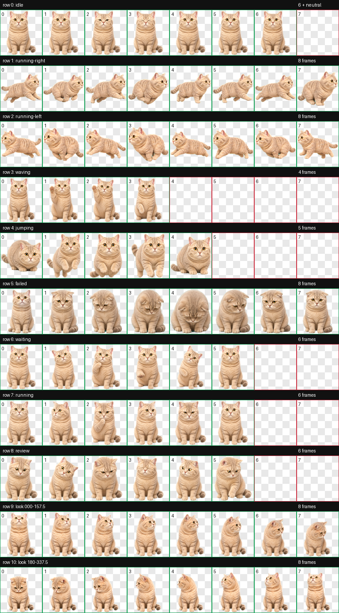

# Timi Desktop Pet

Timi is a lightweight animated desktop cat for macOS and Windows. The standalone app does not require Codex. It uses the same validated v2 sprite atlas as the optional Codex pet package.



## Features

- Transparent, frameless, always-on-top desktop window
- Nine standard animations and sixteen look directions
- Single click to wave; double click to jump
- Press and hold to drag Timi anywhere on the desktop
- Optional screen-edge wandering with left/right gait animation
- 80%, 100%, and 120% display sizes
- Position and preferences saved locally
- Tray controls for showing Timi, restoring mouse interaction, and quitting
- Native macOS and Windows installers built with Tauri 2

Right-click Timi to open the controls. When click-through mode is enabled, use the Timi tray icon to turn it off again.

## Download

Download a macOS DMG or Windows installer from [GitHub Releases](https://github.com/csoss/desktop-pet/releases).

Unsigned development builds may show an operating-system security warning. Production releases should be code-signed and, on macOS, notarized.

## Develop

Requirements:

- Node.js 22 or later
- Rust stable
- Tauri 2 platform prerequisites

```bash
git clone https://github.com/csoss/desktop-pet.git
cd desktop-pet
npm install
npm run tauri dev
```

Frontend-only preview:

```bash
npm run dev
```

iPhone preview on the same Wi-Fi network:

```bash
npm run dev:phone
```

Open the printed network URL in iPhone Safari. The responsive web mode reuses the
same pet animation without changing the macOS or Windows Tauri application. When
served over HTTPS, it can also be added to the Home Screen as a lightweight PWA.

The `Deploy iPhone preview` workflow publishes the PWA to GitHub Pages at
`https://csoss.github.io/desktop-pet/` whenever `main` is updated.

Production build:

```bash
npm run tauri build
```

The macOS build uses Tauri's private transparent-window API, so direct DMG distribution is supported but Mac App Store submission is not.

## Create a release

The release workflow builds macOS universal and Windows x64 installers. Update the version in `package.json`, `src-tauri/Cargo.toml`, and `src-tauri/tauri.conf.json`, then push a matching tag:

```bash
git tag app-v0.1.0
git push origin app-v0.1.0
```

GitHub Actions creates a draft release containing the platform installers.

## Optional Codex installation

Timi can still be installed as a Codex custom pet:

```bash
./install.sh
```

This copies `pets/timi/pet.json` and `pets/timi/spritesheet.webp` to `${CODEX_HOME:-$HOME/.codex}/pets/timi`.

## Sprite format

- `spriteVersionNumber: 2`
- 8 columns × 11 rows
- 192 × 208 pixels per cell
- 1536 × 2288 pixels overall
- rows 0–8: idle, directional running, waving, jumping, failed, waiting, active work, and review
- rows 9–10: sixteen clockwise look directions

The standalone renderer reads the same atlas directly; Codex is not involved at runtime.

## 中文说明

Timi 是一个不依赖 Codex 的独立桌面宠物，支持 macOS 和 Windows。

- 单击挥爪，双击跳跃
- 长按拖动位置
- 右键打开控制菜单
- 可选自动行走、始终置顶、大小调整和鼠标穿透
- 自动保存位置和偏好设置
- 托盘菜单可恢复鼠标交互或退出

开发运行：

```bash
npm install
npm run tauri dev
```

iPhone 快速预览（Mac 与 iPhone 连接同一个 Wi-Fi）：

```bash
npm run dev:phone
```

然后用 iPhone Safari 打开终端显示的 Network 地址。移动网页模式与 macOS、
Windows 桌面应用共用动画资源，不会改变桌面端行为；通过 HTTPS 部署后还可
“添加到主屏幕”。

推送到 `main` 后，`Deploy iPhone preview` 工作流会自动发布到：
`https://csoss.github.io/desktop-pet/`，此方式不要求 iPhone 与 Mac 在同一网络。

构建安装包：

```bash
npm run tauri build
```

如果只想把 Timi 安装到 Codex，仍可运行 `./install.sh`。

## License

The application, manifest, installer, preview, and Timi spritesheet are distributed under the [MIT License](LICENSE).
